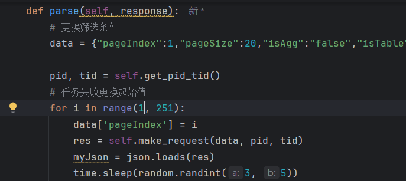

# 企查查数据爬取【scrapy框架】
### 1. 登录企查查vip或svip账号

### 2. 复制登录cookie信息至`qichacha/mySpider/mySpider/spiders/qcc.py`

### 3. 通过命令行进入`qichacha/mySpider/`文件目录下

### 4. 执行命令`scrapy crawl qcc`开启爬虫

### 5. 若爬虫任务因为企查查限制而报错，请重新登录，重复步骤1、2、3，并调整爬取目标页码

